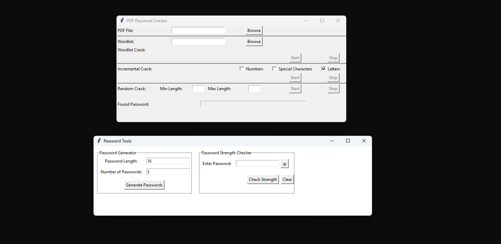

# PDF-Crack-Password-Kit

PDF-Crack-Password-Kit is a Python application designed to crack passwords of PDF files, generate secure passwords, and validate password strength. It features a user-friendly graphical interface for easy usage.

<p align="center">
    
</p>

## Features

- Crack passwords of PDF files.
- Generate secure passwords.
- Check the strength of passwords.

## Requirements

- Python 3.x
- Tkinter (for GUI)
- pikepdf (for PDF password cracking)
- tqdm (for progress bars)

## Installation

Clone the repository:

```bash
git clone https://github.com/Rvignesh5/PDF-Crack-Password-Kit.git
```

## Follow the on-screen instructions to:
- Crack passwords of PDF files.
- Generate secure passwords.
- Check the strength of passwords.

## Notes
- Make sure you have Python installed on your system.
- Ensure that you have the necessary permissions to install packages using pip.

## Output
<p align="center">
      
</p> 
 
The application provides various functionalities, including cracking passwords of PDF files, generating secure passwords, and checking the strength of passwords, all within a user-friendly graphical interface.

## License
This project is licensed under the MIT License. See the [LICENSE](LICENSE) file for details.

Feel free to customize and expand upon this guide as needed for your project.

